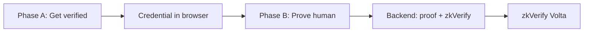

# Proof-of-Human Verification Gateway · zkVerify

A proof-of-human verification gateway: one integration gives partners bot-resistant signups and waitlists; every verification is a ZK proof verified on [zkVerify](https://zkverify.io). Partners get **no PII storage**, **no SMS vendor contracts**, and **no bot-farm exposure**; we roadmap decentralizing nullifier checks (partners can verify directly on zkVerify’s chain). This repo includes a **demo** (simulated) and **live zkVerify** mode (real proofs on Volta testnet).

---

## Architecture

- **Phase A (Get verified):** User verifies via phone or email (simulated in demo). Backend issues an anonymous credential (commitment); credential is stored in the browser. No phone/email is stored.
- **Phase B (Prove human):** On a partner site, the user proves they hold a valid credential. The app generates a **Groth16 ZK proof**; the backend submits it to **zkVerify** via [zkVerifyJS](https://docs.zkverify.io/overview/zkverifyjs). The partner sees only "verified" and an optional receipt.



Detailed design: [docs/architecture-and-risks.md](docs/architecture-and-risks.md). **How we integrate with zkVerify** (proof generation, zkVerifyJS, official docs): [docs/zkverify-how-we-integrate.md](docs/zkverify-how-we-integrate.md). Sign up / sign in flow: [docs/sign-up-sign-in-with-zk-proof.md](docs/sign-up-sign-in-with-zk-proof.md). How we would verify age (roadmap): [docs/how-we-would-verify-age.md](docs/how-we-would-verify-age.md). In the app, open **How it works** for a visual workflow.

---

## Requirements

- **Node.js** 18+ (20+ recommended for zkVerifyJS)
- **npm** or yarn
- For **live zkVerify mode:** a funded Volta testnet account (tVFY from [faucet](https://docs.zkverify.io/overview/important-links))
- Optional (for building circuits): **Circom** and **snarkjs** — or use pre-built artifacts

---

## Install & run

```bash
git clone https://github.com/panagot/ZKVERIFY.git
cd ZKVERIFY
npm install
npm run dev
```

Open **http://localhost:5173**. You can use the app in **Demo mode** (no backend) or **Live zkVerify mode** (with backend and env).

---

## Demo mode (default)

- No backend or env required. ZK and zkVerify are **simulated** in the browser.
- **Get verified** → choose Phone or Email, use code **30322** → credential stored in `localStorage`.
- **Prove human** → click "Join waitlist"; mock proof is "sent" and you see a simulated receipt.
- Use this to understand the flow and for local demos.

---

## Live zkVerify mode (real proofs on Volta)

This repo submits **real** Groth16 proofs to [zkVerify's Volta testnet](https://docs.zkverify.io/overview/important-links) via [zkVerifyJS](https://docs.zkverify.io/overview/zkverifyjs). When the **backend** is running and **env** is set, the frontend uses it to generate and submit proofs.

1. **Get tVFY** from the [zkVerify Volta faucet](https://docs.zkverify.io/overview/important-links) for your submitter account. The **backend’s funded account** pays verification fees for each proof; no user wallet is required.
2. **Configure env** — copy `.env.example` to `.env` and set `ZKVERIFY_VOLTA_SEED` (mnemonic for the funded account).
3. **Build circuit** (once): `npm run circuit:build` — see [Circuit](#circuit) below.
4. **Start backend:** `npm run server` (runs on `PORT`, default 3001). Use `GET /api/health` to confirm the server has seed + circuit and is ready for live submissions.
5. **Start frontend** with API URL: `VITE_API_URL=http://localhost:3001 npm run dev`.
6. **Prove human** — the app will call the backend; the backend generates the proof and submits it to zkVerify; you'll see a real tx hash and receipt.

---

## Environment

| Variable | Description |
|----------|-------------|
| `ZKVERIFY_VOLTA_SEED` | Mnemonic for the Volta account that submits proofs (needs tVFY). |
| `PORT` | Backend port (default `3001`). |
| `VITE_API_URL` | Backend URL for the frontend (e.g. `http://localhost:3001`). If unset, **demo mode** is used. |

- Backend: copy [.env.example](.env.example) to `.env` and set `ZKVERIFY_VOLTA_SEED`.
- Frontend (live mode): set `VITE_API_URL` in `.env.local` or when running `npm run dev`. See [.env.example.frontend](.env.example.frontend).

---

## Circuit

A minimal Circom circuit proves knowledge of a secret that hashes to the user's commitment and derives a nullifier per campaign. It is compiled to **Groth16** (snarkjs) and used by the backend to generate proofs.

- **Source:** `circuits/proof_of_human.circom`
- **Build:** `npm run circuit:build` (requires Circom and snarkjs; see [circuits/README.md](circuits/README.md))
- **Output:** `circuits/out/` (vk, wasm, etc.). Pre-built artifacts can be committed so reviewers can run without Circom.

---

## Links

- [zkVerify Documentation](https://docs.zkverify.io/)
- [zkVerifyJS Reference](https://docs.zkverify.io/overview/zkverifyjs)
- [zkVerify Important Links](https://docs.zkverify.io/overview/important-links) (Volta RPC, faucet)
- [zkVerify Mainnet & VFY](https://zkverify.io/blog/zkverify-mainnet-and-vfy-is-live)

---

## For reviewers

- **Run the app (demo):** `npm install` then `npm run dev`. Open http://localhost:5173. Use **Get verified** (code `30322`) then **Prove human** to see the full flow. No backend required; proofs are simulated.
- **Run with real zkVerify:** See [Live zkVerify mode](#live-zkverify-mode-real-proofs-on-volta) and [docs/tools-and-setup.md](docs/tools-and-setup.md) for env, circuit build, and `npm run server`. Backend must have `ZKVERIFY_VOLTA_SEED` and circuit artifacts in `circuits/out/`.
- **Key docs:** [docs/architecture-and-risks.md](docs/architecture-and-risks.md) (technical design), [docs/use-cases-and-roadmap.md](docs/use-cases-and-roadmap.md) (use cases and roadmap), [docs/web2-program-requirements-mapping.md](docs/web2-program-requirements-mapping.md) (Web2 program requirements and signup use case). Scripts and API: [docs/tools-and-setup.md](docs/tools-and-setup.md).

---

## Documentation

- [docs/architecture-and-risks.md](docs/architecture-and-risks.md) — Technical architecture, risks & mitigations, commitment/nullifier pattern, circuit design.
- [docs/use-cases-and-roadmap.md](docs/use-cases-and-roadmap.md) — Use cases beyond SMS (email, World ID, proof-of-knowledge, age gate, voting); Web2 signup (prove age, email, phone without PII).
- [docs/web2-program-requirements-mapping.md](docs/web2-program-requirements-mapping.md) — Web2 program: requirements mapping, Key Requirements, milestones.
- [docs/sign-up-sign-in-with-zk-proof.md](docs/sign-up-sign-in-with-zk-proof.md) — **Sign up / Sign in with ZK proof:** no email or phone in Site B's DB; only zk_identifier + verified flags.
- [docs/zkverify-how-we-integrate.md](docs/zkverify-how-we-integrate.md) — How we integrate with zkVerify (proof generation, zkVerifyJS).
- [docs/how-we-would-verify-age.md](docs/how-we-would-verify-age.md) — Roadmap: age/eligibility verification without PII.

---

## License

MIT — see [LICENSE](LICENSE).
